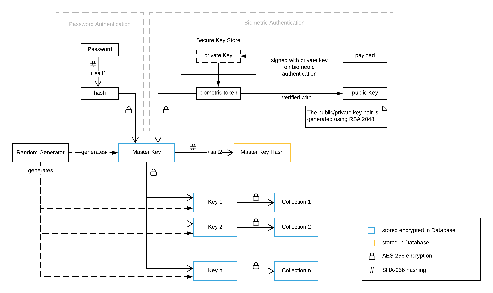

# Encryptor

This is a react-native Password Manager App that stores your credentials securely encrypted on your phone. You can protect them with a password and optionally your Fingerprint or FaceID (if available). 

It uses SHA-256 hashing and AES-256 Encryption to encrypt your secrets. They are stored in the form of collections where each collection holds a list of key-value pairs. Each collection has its own AES-256 key that is used to encrypt its JSON representation. This key is randomly generated and will be stored encrypted with a master key that will again be stored encrypted once with a password hash and once with a signed biometric token (optional). That way, you can access all of your secrets only when you have the password or the biometric token. Here's an overview of the encryption schema:



## Features

- Storing and encryption of arbitrary key value pairs on the device (offline)
- Password protection
- Support for Fingerprint and FaceID authentication
- Use of an individual key for each collection
- Automatic logout after x minutes
- Animated UI
- Dark/Light Mode

# Screenshots


Dark Mode


## How to use

**A prebuilt version of this app as .apk file can be downloaded [here]()**

clone this repo and run

```bash
yarn install
```
to run the app for android (in debug mode) run

```bash
react-native run-android
```

for building the release apk, `cd` into the `android` directory and run

```
gradle clean
gradle assembleRelease
```

the final `.apk` will then be available under `./android/app/build/outputs/apk/release/app-release.apk`.